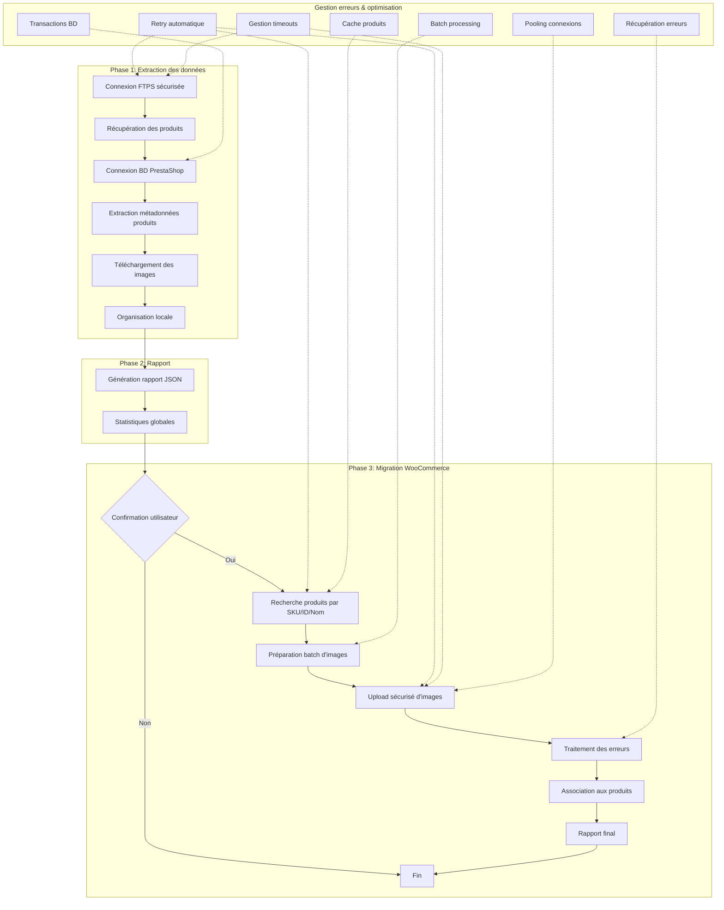

# PrestaShop to WordPress/WooCommerce Image Migration

Ce script permet la migration automatisée des images de produits d'un site PrestaShop vers un site WordPress/WooCommerce, avec une gestion avancée des métadonnées et du stock.

## Aperçu du processus de migration



## Fonctionnalités

- Extraction des données produits depuis PrestaShop (nom, SKU, stock)
- Organisation hiérarchique des images par produit
- Renommage automatique des images selon le format `nom-produit-numero.jpg`
- Génération de rapports détaillés au format JSON
- Migration contrôlée vers WooCommerce avec traitement par lots
- Gestion avancée des erreurs avec types d'exceptions dédiées
- Transactions de base de données sécurisées
- Connexion FTP sécurisée (FTPS) avec protection des données
- Gestion des timeouts et retries pour les requêtes réseau
- Optimisation des requêtes API par batching et mise en cache
- Recherche de produits par SKU, ID ou nom
- Nettoyage automatique des ressources

## Processus de Migration

Le script exécute la migration en trois phases distinctes :

1. **Extraction des données PrestaShop**
   - Connexion sécurisée FTPS au serveur PrestaShop
   - Connexion sécurisée à la base de données PrestaShop
   - Récupération des noms de produits, SKUs et stocks avec validation
   - Création de dossiers par produit
   - Téléchargement et organisation des images avec vérification d'intégrité
   - Gestion des timeouts et retries pour les connexions instables

2. **Génération du rapport**
   - Création d'un rapport JSON détaillé
   - Statistiques globales (nombre de produits, images, stock total)
   - Détails par produit (nom, SKU, nombre d'images, stock)
   - Analyse des succès et échecs
   - Étape de validation avant migration

3. **Migration vers WooCommerce**
   - Proposition de migration après vérification des données
   - Recherche optimisée des produits par SKU, ID, puis nom
   - Préparation des lots d'images pour optimiser les requêtes API
   - Upload contrôlé des images avec gestion des retries
   - Mécanisme d'optimisation pour réduire les requêtes API
   - Détection des images déjà existantes pour éviter les doublons
   - Gestion de files d'attente pour les grands volumes
   - Poursuite de la migration même en cas d'échec partiel

## Prérequis

- Python 3.7 ou supérieur
- Accès FTPS au site PrestaShop
- Accès à la base de données PrestaShop
- Accès API au site WordPress/WooCommerce
- MySQL/MariaDB pour la connexion à la base de données PrestaShop

## Installation

1. Clonez le dépôt :
```bash
git clone [REPO_URL]
cd prestashop-wp-image-migrator
```

2. Installez les dépendances :
```bash
pip install -r requirements.txt
```

3. Configurez les variables d'environnement :
```bash
cp .env.example .env
```

4. Modifiez le fichier `.env` avec vos informations :
```env
# Configuration FTP(S) PrestaShop
FTP_HOST=votre_serveur_ftp
FTP_USER=votre_utilisateur_ftp
FTP_PASS=votre_mot_de_passe_ftp
FTP_IMG_PATH=/chemin/vers/images
FTP_USE_SSL=true
FTP_PORT=21

# Configuration WordPress/WooCommerce
WP_API_URL=https://votre-site.com/wp-json/wc/v3
WP_API_USER=votre_cle_api
WP_API_PASS=votre_secret_api
WP_API_TIMEOUT=30
WP_API_BATCH_SIZE=5

# Configuration Base de données PrestaShop
DB_HOST=localhost
DB_PORT=3306
DB_NAME=nom_base_prestashop
DB_USER=utilisateur_db
DB_PASS=mot_de_passe_db
DB_PREFIX=ps_
```

## Structure du Projet

```
.
├── config.py          # Configuration globale et chargement des variables d'environnement
├── exceptions.py      # Gestion des exceptions personnalisées
├── migrator.py        # Script principal
├── requirements.txt   # Dépendances
├── .env               # Variables d'environnement
├── logs/              # Dossiers de logs et rapports
└── temp_images/       # Images temporaires (nettoyé automatiquement)
```

## Utilisation

1. Exécutez le script :
```bash
python migrator.py
```

2. Le script va :
   - Se connecter de façon sécurisée au serveur FTPS PrestaShop
   - Se connecter à la base de données PrestaShop
   - Extraire les données des produits
   - Créer des dossiers par produit
   - Télécharger et organiser les images
   - Générer un rapport JSON
   - Proposer la migration vers WooCommerce

## Configuration avancée

### Options de sécurité FTPS

Le script supporte différentes configurations de connexion FTPS :

- **FTPS explicite** (port 21) : Le mode par défaut, qui commence par une connexion non-chiffrée puis passe en mode sécurisé
- **FTPS implicite** (port 990) : Une connexion entièrement chiffrée depuis le début

Pour configurer le mode FTPS implicite, ajoutez ces paramètres à votre fichier `.env` :
```
FTP_USE_SSL=true
FTP_IMPLICIT_SSL=true
FTP_PORT=990
```

### Optimisation des requêtes API

Vous pouvez configurer le traitement par lots pour optimiser les performances lors de la migration :

```
WP_API_BATCH_SIZE=10       # Nombre d'images traitées par lot
WP_API_POOL_CONNECTIONS=10 # Nombre de connexions simultanées
WP_API_RETRY_ATTEMPTS=3    # Tentatives de reconnexion
```

## Rapports

Les rapports sont générés dans le dossier `logs/` avec :
- Un fichier de log détaillé par exécution
- Un rapport JSON contenant :
  ```json
  {
    "timestamp": "2024-04-14T12:00:00",
    "products": {
      "nom-produit": {
        "id": "123",
        "sku": "SKU123",
        "images": 3,
        "stock": 10,
        "folder": "/chemin/vers/dossier"
      }
    },
    "summary": {
      "total_products": 50,
      "total_images": 150,
      "total_stock": 500,
      "successful_migrations": 48,
      "failed_migrations": 2,
      "upload_performance": {
        "average_upload_time": "1.2s",
        "max_upload_time": "3.5s"
      }
    }
  }
  ```

## Performance et optimisation

Le script utilise plusieurs techniques pour optimiser la performance et la fiabilité :

- **Traitement par lots** : Les images sont traitées par lots pour réduire le nombre de requêtes API
- **Mise en cache** : Les informations de produits sont mises en cache pour éviter les requêtes redondantes
- **Connexions persistantes** : Réutilisation des connexions HTTP pour améliorer les performances
- **Téléchargements parallèles** : Possibilité de télécharger plusieurs images simultanément
- **Détection des doublons** : Évite de télécharger ou uploader les mêmes images plusieurs fois
- **Optimisation des requêtes SQL** : Utilisation de requêtes préparées et indexées

## Gestion des Erreurs

Le script utilise un système avancé de gestion d'erreurs avec:

- **Types d'exceptions personnalisées**:
  - `DatabaseError`: Problèmes de connexion à la base de données
  - `FTPConnectionError`: Erreurs de connexion FTPS
  - `ImageUploadError`: Échecs d'upload d'images
  - `APIError`: Erreurs d'API WooCommerce
  - `FileSystemError`: Problèmes liés au système de fichiers
  - `ProductNotFoundError`: Produits non trouvés

- **Mécanismes de récupération**:
  - Retries automatiques pour les requêtes API et FTPS
  - Gestion des timeouts avec paramètres configurables
  - Continuité d'exécution en cas d'échec partiel
  - Utilisation de gestionnaires de contexte pour garantir la libération des ressources
  - Transactions atomiques pour la base de données

- **Logging complet**:
  - Enregistrement détaillé de toutes les actions
  - Niveaux de log configurables
  - Horodatage précis des événements
  - Détails des erreurs pour faciliter le débogage
  - Rapports de performance

## Sécurité

- **Protection des données sensibles**:
  - Variables d'environnement stockées de manière sécurisée dans `.env`
  - Aucun identifiant en dur dans le code
  - Paramètres de connexion chargés à l'exécution

- **Sécurité des connexions**:
  - Utilisation de FTPS au lieu de FTP pour chiffrer les transferts de fichiers
  - Validations des données avant insertion
  - Protection contre les injections SQL (paramètres préparés)
  - Transactions de base de données pour garantir l'intégrité
  - Nettoyage des noms de fichiers pour éviter les injections de chemin

- **Isolation des ressources**:
  - Fichiers temporaires automatiquement supprimés
  - Fermeture appropriée de toutes les connexions
  - Gestion correcte des transactions
  - Limitations de privilèges pour les opérations

## Dépannage

### Problèmes de connexion FTPS

Si vous rencontrez des problèmes de connexion FTPS :
1. Vérifiez que le port correct est utilisé (21 pour FTPS explicite, 990 pour FTPS implicite)
2. Assurez-vous que le serveur supporte le mode FTPS choisi
3. Vérifiez les certificats SSL si nécessaire

### Timeouts fréquents

Si vous rencontrez des timeouts fréquents :
1. Augmentez les valeurs de timeout dans le fichier `.env`
2. Réduisez la taille des lots (`WP_API_BATCH_SIZE`)
3. Vérifiez la connexion réseau

## Contribuer

Les contributions sont les bienvenues ! Pour contribuer :
1. Fork le projet
2. Créez une branche (`git checkout -b feature/AmazingFeature`)
3. Committez vos changements (`git commit -m 'Add some AmazingFeature'`)
4. Push vers la branche (`git push origin feature/AmazingFeature`)
5. Ouvrez une Pull Request

## Licence

Ce projet est sous licence MIT. Voir le fichier `LICENSE` pour plus de détails. 